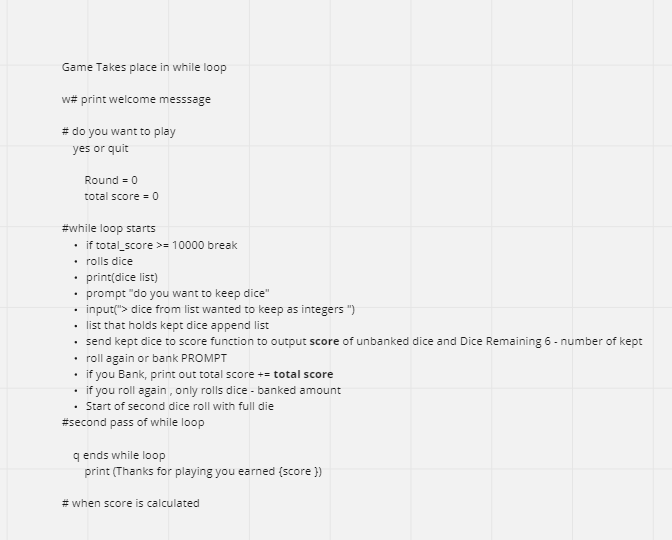

# LAB - Class 08

## Project: 

ten_thousand

## Author: 

Dylan Cabral
Ian Shirley 
Aubrey Corsetti
Oliver Speir
Harper Foley
Keyan Tabor

## Links and Resources

[Counter Method](https://realpython.com/python-counter/)

[Lists Comprehension](https://www.pythonforbeginners.com/basics/list-comprehensions-in-python)
.venv
install pytest
python 3.11
(https://github.com/codefellows/seattle-code-python-401d20/tree/main/class-07/lab/tests/version_3)

python main.py

## Tests
Tests were supplied in class repo, initialized and tested in pytest
tested in running of code according to simulation in text files as reference

## How do you run tests?
pytest in test folder in terminal for lab 06, and 08

lab 07 was based off sim files

we ran tests for lab 07 in the terminal, reading the file and outputs to make sure they 
match the reference simulation.txt file

## Any tests of note?
All tests pass according to testing parameters
game works under r, b,q and n situations

zilch is outputted, hot dice working, banking and unbanked points works all functions up to par